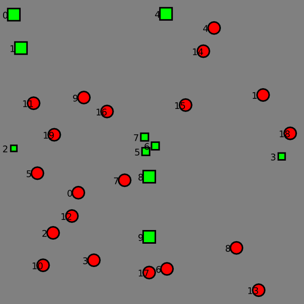
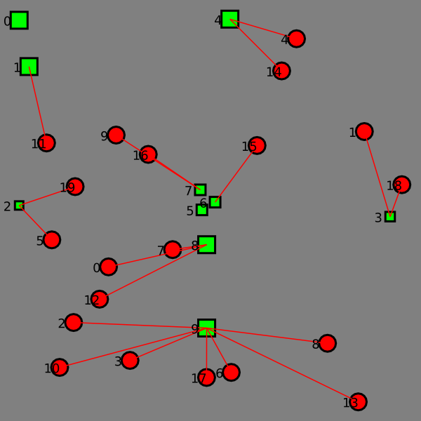

TyphoonShelterOptimizer
=======================

Simulated Annealing optimizer to find an optimal assignment of 
villages to typhoon shelters

You provide it with the location of villages
and potential shelter locations and their sizes.
It will compute an optimal assignment of villages to shelters.

